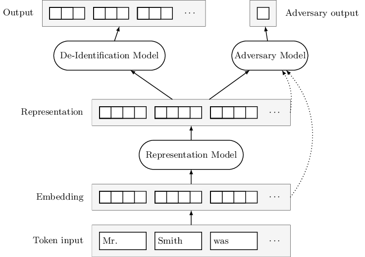
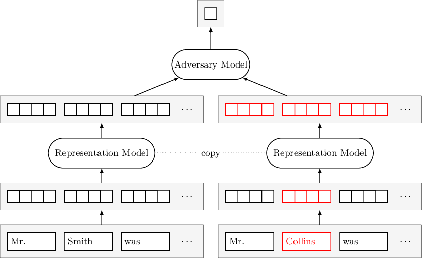

# Sharing Training Data for De-Identification

[](https://www.travis-ci.org/maxfriedrich/deid-training-data)

**Update 2019-08-11:** Our paper ["Adversarial Learning of Privacy-Preserving Text Representations for De-Identification of Medical Records"](https://www.aclweb.org/anthology/papers/P/P19/P19-1584/) was published at ACL 2019.

This is the code for my [Master's thesis](https://www.inf.uni-hamburg.de/en/inst/ab/lt/teaching/theses/completed-theses/2018-ma-friedrich.pdf). It's about automatic transformations that can be applied to medical text data that…

- allow training a de-identification model (i.e. finding all protected information in text)
- do not allow attackers to infer any protected information.

## Main Contribution

An adversarial deep learning architecture that learns a private representation of medical text. The representation model is an LSTM model that adds Gaussian noise of a trainable scale to its inputs and outputs.



The representation fulfills two invariance criteria that are both enforced by binary classifier LSTM adversary models that receive sequence pairs as inputs.

Left: Representations should be invariant to *any* protected information token being replaced with a neighbor in an embedding space (e.g. substituting a name or date).

Right: Looking up the same token sequence multiple times should result in a representation that is randomly different by a high enough degree that it could be the representation of a neighboring sequence.

&nbsp;&nbsp;&nbsp;

## Installation

- Checkout the repository including submodules. If you're doing a new clone:

  ```bash
  git clone --recurse-submodules git@github.com:maxfriedrich/deid-training-data.git
  ```

- Or, if you already cloned the repository:

  ```bash
  git submodule update --init
  ```

- Create a Conda environment for the project. If you want the environment name to be something other than `deid-training-data` or use `tensorflow-gpu` instead of `tensorflow`, adapt the `environment.yml` file before running this command. Then activate the environment.

  ```bash
  cd deid-training-data
  conda env create
  conda activate deid-training-data
  ```

- Download the English language model for spaCy:

  ```bash
  python -m spacy download en
  ```

- Verify that the environment is working by running the tests:

  ```bash
  DEID_TEST_CONFIG=1 nosetests --with-doctest
  ```

- Adapt the [environment file](deid/env.py).

- Decide with embeddings you want to use:

  - For **FastText**, get a [fastText embeddings binary](https://s3-us-west-1.amazonaws.com/fasttext-vectors/wiki-news-300d-1M-subword.bin.zip) (4.5 GB download) as well as the [corresponding `.vec` file of precomputed embeddings](https://s3-us-west-1.amazonaws.com/fasttext-vectors/wiki-news-300d-1M-subword.vec.zip) (590 MB download) and put it them the resources directory. Adapt the path [here](deid/embeddings/fasttext.py) if necessary. Then convert the precomputed fastText embeddings to a `{word: ind}` dictionary and numpy matrix file:

    ```bash
    python -m deid.tools.embeddings --fasttext-precomputed
    ```
  
  - For **GloVe**, download [a set of pre-trained word vectors](https://github.com/stanfordnlp/GloVe#download-pre-trained-word-vectors) and put it into the resources directory. Adapt the path and dimension [here](deid/embeddings/glove.py) if you're not using the Wikipedia-pretrained 300d embeddings.
  
  - For **ELMo**, you don't need to download anything.

- Get the [i2b2 data](https://www.i2b2.org/NLP/DataSets/) and extract `training-PHI-Gold-Set1` into `train_xml`, `training-PHI-Gold-Set2` into `validation_xml`, and `testing-PHI-Gold-fixed` into a `test_xml` directory.

- Fix one of the xml files where indices are offset after a special character:

  ```bash
  python -m deid.tools.fix_180-03 /path/to/validation_xml
  ```

- Convert the xml files with standoff annotations to an IOB2 format csv and a txt file containing the raw text:

  ```bash
  ./scripts/xml_to_csv
  ```

  The `xml_to_csv` script calls the `deid.tools.i2b2_xml_to_csv` module with the `train_xml`, `validation_xml` and `test_xml` directories. It will output some inconsistencies in the data (standoff annotation texts differ from original text), but we'll ignore those for now.

- Create an embeddings cache, again depending on your choice(s) of embeddings:

  - For **FastText**, this command writes all words from the train, test, and validation set to a pickle cache (5 minutes on my machine).

    ```bash
    python -m deid.tools.embeddings --fasttext-cache
    ```

  - For **ELMo**, this command looks up all sentences from the train, test, and validation set and writes them to many pickle files. This is slow, taking up to 3 hours.

    ```bash
    python -m deid.tools.embeddings --elmo-cache
    ```

## Experiments

You can find these experiments in the [`deid/experiment`](deid/experiment) directory:

- A [basic experiment](deid/experiment/basic.py) that can be used for training models on raw as well as augmented data
- An implementation of [alternating adversarial training](deid/experiment/alternating.py) similar to [Feutry et al. (2018)](https://arxiv.org/abs/1802.09386)
- Evaluation experiments for [automatic pseudonymization](deid/experiment/mtn_evaluation.py), discriminating [real from automatically pseudonymized sentences](deid/experiment/fake_sentences.py), and the [alternating training](deid/experiment/alternating_evaluation.py)

To run an experiment:

- Modify the [example config template](deid/config_template.yaml.example) and rename it to `.yaml`. Generate configs from it using the `config` tool:

  ```bash
  python -m deid.tools.config /path/to/config_template.yaml
  ```

  Specify the number of configs with the `-n` option. For a grid search instead of random samples, use the `-a` option (careful, this might generate thousands of configs depending on the hyperparameter space!).

- Run a single experiment from a config:

  ```bash
  python -m deid.experiment /path/to/config.yaml
  ```

  This will output predictions and save a history pickle to an experiment directory inside `env.work_dir`.

- Or set the `DEID_CONFIG_DIR` variable to the config directory and use the `queue` script to run all experiment configs from the `${DEID_CONFIG_DIR}/todo` directory (they will be processed sequentially and moved to the `${DEID_CONFIG_DIR}/done` directory).

  ```bash
  DEID_CONFIG_DIR=/path/to/config/dir ./scripts/queue
  ```

## Evaluation

The evaluation using a [modified version](deid/tools/i2b2) (`2to3`, minor fixes) of the [official evaluation script](https://github.com/kotfic/i2b2_evaluation_scripts) is run automatically in the experiments. You can also call it like this to evaluate a directory of XML predictions:

```bash
python -m deid.tools.i2b2.evaluate phi /path/to/predictions /path/to/i2b2_data/validation_xml/
```
